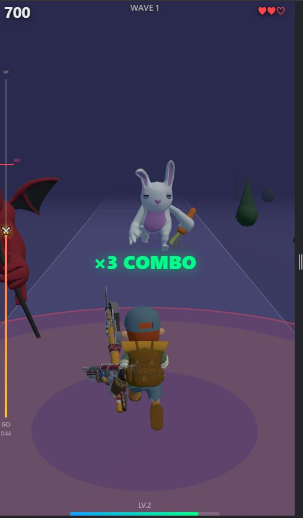

# Monster Slash

Auto-run forward, swipe to slash approaching monsters in rhythm-game timing.

## Play

**[Play on GitHub Pages](https://ariescar0326-sketch.github.io/prototype001-monsterslash/)**

## Controls

- **Swipe** toward monsters when they enter the kill zone
- One-hand portrait mode, designed for mobile

## Tech

- Three.js (r162) + cannon-es physics
- GLTF models
- Single-file HTML, no build step

## Screenshots

